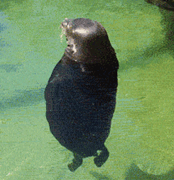
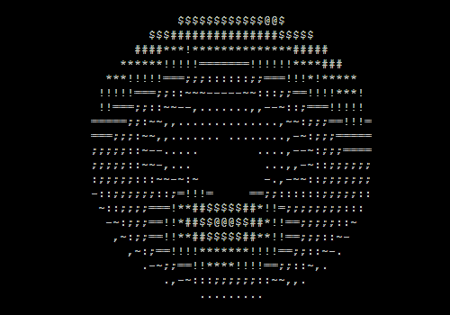

# Matteo Giorgetti (aka Inventure71)

---

### About Me
- 🧠 **First-Year CS & AI Student** @ IE University
- 🎮 Real gamer and F1 fan
- 🤓 Passionate about **game development**, **AI tools**, and creative coding projects  
- ⚙️ Experienced with **Python**, **Unreal Engine**, and building personalized systems  
- 🍺 Powered by RedBull and Beer coder, always exploring new tech and ideas  
- 🌊 Enjoys kitesurfing and coding random projects in my free time  

---

### 🔧 Tech Stack
Here are some of the tools I use: 

---

### 📊 GitHub Stats

  
  

---

### 🌟 Projects & Highlights
Some things I've worked on recently:
Some of the coolest things I've worked on:  
1. **AI-Powered Pokémon Card Generator**  
   - Leveraging text-to-image AI models to create unlimited custom Pokémon-style card art.  
2. **Personalized Chatbot: Budget Buddy**  
   - A financial assistant chatbot that **teaches you how to spend smart, not less**, with actionable insights.  
3. **Game Jam Projects**  
   - Developed games using **Unreal Engine** and **Python integrations**, blending creativity with problem-solving.

---

### 📈 Contribution Graph

---

### 🛠️ Tools & Concepts I’m Exploring
- **Advanced AI Prompt Engineering** for more intuitive interactions  
- **Computer Vision** to analyze and interpret visual data  
- **RAG Methods** for robust knowledge retrieval  
- **Siamese Networks** for handwriting recognition  

---

### 📬 Connect with Me

  

<!--

**Inventure71/Inventure71** is a ✨ _special_ ✨ repository because its `README.md` (this file) appears on your GitHub profile.

Here are some ideas to get you started:

- 🔭 I’m currently working on ...
- 🌱 I’m currently learning ...
- 👯 I’m looking to collaborate on ...
- 🤔 I’m looking for help with ...
- 💬 Ask me about ...
- 📫 How to reach me: ...
- 😄 Pronouns: ...
- ⚡ Fun fact: ...

<h3 align="left">Connect with me:</h3>

-->
